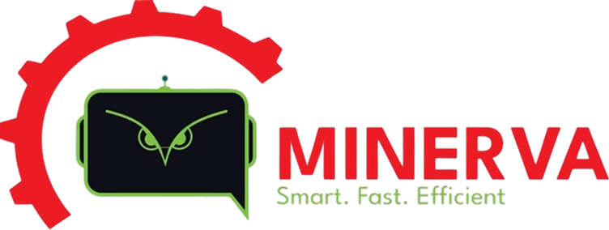

# MINERVA - Company Profile Website



**AI-Powered Digital Twin for Sustainable Manufacturing**

🏆 **Winner of 2025 Hackathon** powered by Ericsson & Qualcomm

---

## 🚀 Overview

MINERVA is an industrial AI platform that delivers real-time Digital Twin optimization for sustainable manufacturing. This repository contains the official company profile website showcasing our products, achievements, and vision for transforming industrial operations through AI and 5G technology.

## ✨ Features

- 🎨 **Modern UI/UX** - Clean, professional B2B design
- 📱 **Fully Responsive** - Optimized for all devices
- ⚡ **High Performance** - Built with Next.js 16 and React 19
- 🔒 **Secure** - Comprehensive security headers and input validation
- 🎯 **SEO Optimized** - Structured data and meta tags
- 3D **Interactive Elements** - Physics-based team cards with Three.js
- 📧 **Working Contact Form** - API integration with validation
- ♿ **Accessible** - WCAG compliant components

## 🛠️ Tech Stack

### Core
- **Framework:** [Next.js 16](https://nextjs.org/) (App Router)
- **Language:** [TypeScript 5](https://www.typescriptlang.org/)
- **Styling:** [Tailwind CSS 4](https://tailwindcss.com/)

### UI & Components
- **UI Library:** [Radix UI](https://www.radix-ui.com/)
- **Icons:** [Lucide React](https://lucide.dev/)
- **Animations:** [Motion](https://motion.dev/) (Framer Motion successor)

### 3D Graphics
- **3D Rendering:** [Three.js](https://threejs.org/)
- **React Integration:** [@react-three/fiber](https://docs.pmnd.rs/react-three-fiber)
- **Helpers:** [@react-three/drei](https://github.com/pmndrs/drei)
- **Physics:** [@react-three/rapier](https://github.com/pmndrs/react-three-rapier)

## 📦 Installation

### Prerequisites
- Node.js 18.17 or later
- npm, yarn, or pnpm

### Setup

1. **Clone the repository**
```bash
git clone https://github.com/your-org/minerva-compro.git
cd minerva-compro
```

2. **Install dependencies**
```bash
npm install
# or
yarn install
# or
pnpm install
```

3. **Set up environment variables**
```bash
cp .env.example .env.local
```

Edit `.env.local` with your configuration:
```env
NEXT_PUBLIC_SITE_URL=http://localhost:3000
NEXT_PUBLIC_CONTACT_EMAIL=minervaenergyid@gmail.com
```

4. **Run development server**
```bash
npm run dev
```

Open [http://localhost:3000](http://localhost:3000) in your browser.

## 🏗️ Project Structure

```
minerva-compro/
├── app/                      # Next.js App Router
│   ├── api/                  # API routes
│   │   └── contact/          # Contact form endpoint
│   ├── product/[id]/         # Dynamic product pages
│   ├── portfolio/            # Portfolio page
│   ├── page.tsx              # Home page
│   ├── layout.tsx            # Root layout
│   ├── error.tsx             # Error page
│   ├── not-found.tsx         # 404 page
│   └── loading.tsx           # Loading state
├── components/               # React components
│   ├── ui/                   # Reusable UI components
│   ├── sections/             # Page sections
│   ├── Navbar.tsx
│   ├── Footer.tsx
│   └── ErrorBoundary.tsx
├── lib/                      # Utilities
│   ├── seo.ts                # SEO configuration
│   ├── validation.ts         # Form validation
│   └── utils.ts              # Helper functions
├── data/                     # Static content
│   ├── products.ts
│   ├── timeline.ts
│   └── about.ts
├── public/                   # Static assets
│   ├── images/
│   ├── videos/
│   └── 3d-model/
└── types/                    # TypeScript types
```

## 🔧 Available Scripts

```bash
# Development
npm run dev          # Start development server

# Build
npm run build        # Build for production
npm run start        # Start production server

# Code Quality
npm run lint         # Run ESLint
npm run lint:fix     # Fix ESLint issues
npm run format       # Format with Prettier
```

## 🌐 Deployment

### Vercel (Recommended)

1. Push your code to GitHub
2. Import your repository on [Vercel](https://vercel.com)
3. Configure environment variables
4. Deploy!

### Manual Deployment

```bash
# Build the application
npm run build

# Start the production server
npm run start
```

## 📧 Contact Form Setup

The contact form is ready to use with the `/api/contact` endpoint. To enable email notifications:

### Option 1: Using Resend (Recommended)

1. Sign up at [Resend](https://resend.com)
2. Get your API key
3. Add to `.env.local`:
```env
RESEND_API_KEY=your_api_key
```

4. Install Resend:
```bash
npm install resend
```

5. Update `app/api/contact/route.ts` to use Resend

### Option 2: Using SendGrid

1. Sign up at [SendGrid](https://sendgrid.com)
2. Get your API key
3. Add to `.env.local`:
```env
SENDGRID_API_KEY=your_api_key
```

4. Install SendGrid:
```bash
npm install @sendgrid/mail
```

## 🔒 Security Features

- ✅ Security headers (HSTS, CSP, X-Frame-Options)
- ✅ Input validation and sanitization
- ✅ Rate limiting on API routes
- ✅ XSS protection
- ✅ CSRF protection ready
- ✅ Environment variable validation

## 📈 Performance Optimizations

- ✅ Next.js Image optimization
- ✅ Dynamic imports for heavy components
- ✅ Font optimization with `display: swap`
- ✅ Lazy loading for 3D models
- ✅ Compression enabled
- ✅ Static generation for product pages

## 🎨 Customization

### Update Site Content

Edit the data files in the `/data` folder:
- `products.ts` - Product information
- `timeline.ts` - Company roadmap
- `about.ts` - Vision and mission

### Modify Colors

Update colors in:
- `app/globals.css` - CSS variables
- `tailwind.config.ts` - Tailwind theme

### Change Contact Info

Update in `/lib/seo.ts`:
```typescript
export const siteConfig = {
  name: 'MINERVA',
  contact: {
    email: 'your-email@domain.com',
    phone: '+1234567890',
  },
  // ...
};
```

## 🐛 Known Issues

- Blog page is a placeholder (coming soon)
- 3D models require good GPU for smooth performance
- Contact form needs email service configuration

## 🤝 Contributing

We welcome contributions! Please follow these steps:

1. Fork the repository
2. Create a feature branch (`git checkout -b feature/AmazingFeature`)
3. Commit your changes (`git commit -m 'Add some AmazingFeature'`)
4. Push to the branch (`git push origin feature/AmazingFeature`)
5. Open a Pull Request

## 📄 License

This project is proprietary and confidential. © 2025 MINERVA Team. All rights reserved.

## 👥 Team

- **Adrian** - Lead Developer
- **Dhafin** - Project Manager
- **Resan** - AI Engineer
- **Rafi** - Backend Developer

## 📞 Support

For support, email: [minervaenergyid@gmail.com](mailto:minervaenergyid@gmail.com)

Or reach us on WhatsApp: [+62 822-1725-7007](https://wa.me/6282217257007)

## 🙏 Acknowledgments

- Ericsson & Qualcomm for Hackathon 2025
- Ministry of Industry & Komdigi for support
- All our industry partners

---

**Made with ❤️ by the MINERVA Team**

[Website](https://minerva-energy.com) • [LinkedIn](https://linkedin.com/company/minerva-energy)
